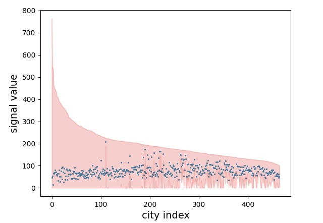
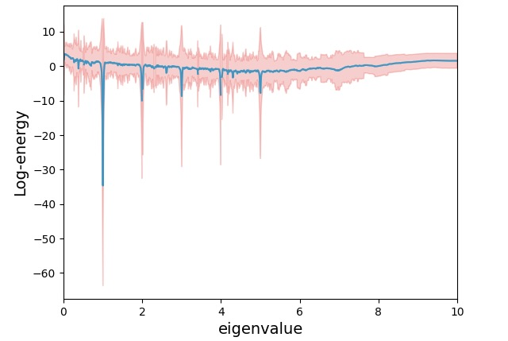
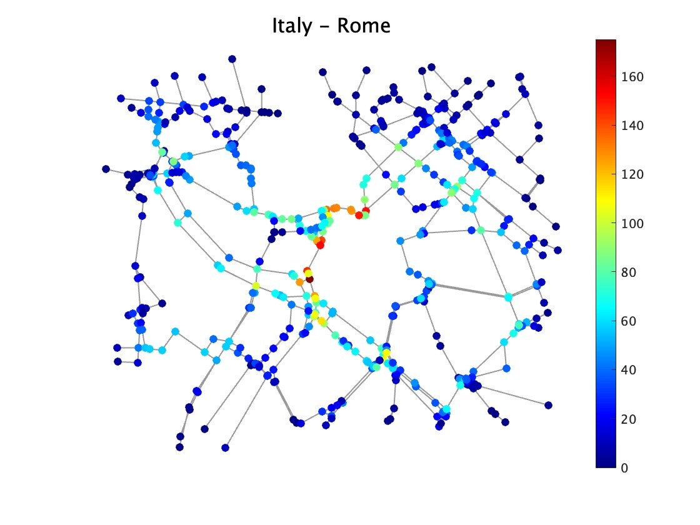
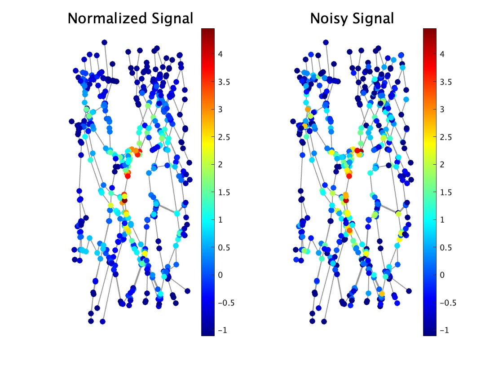
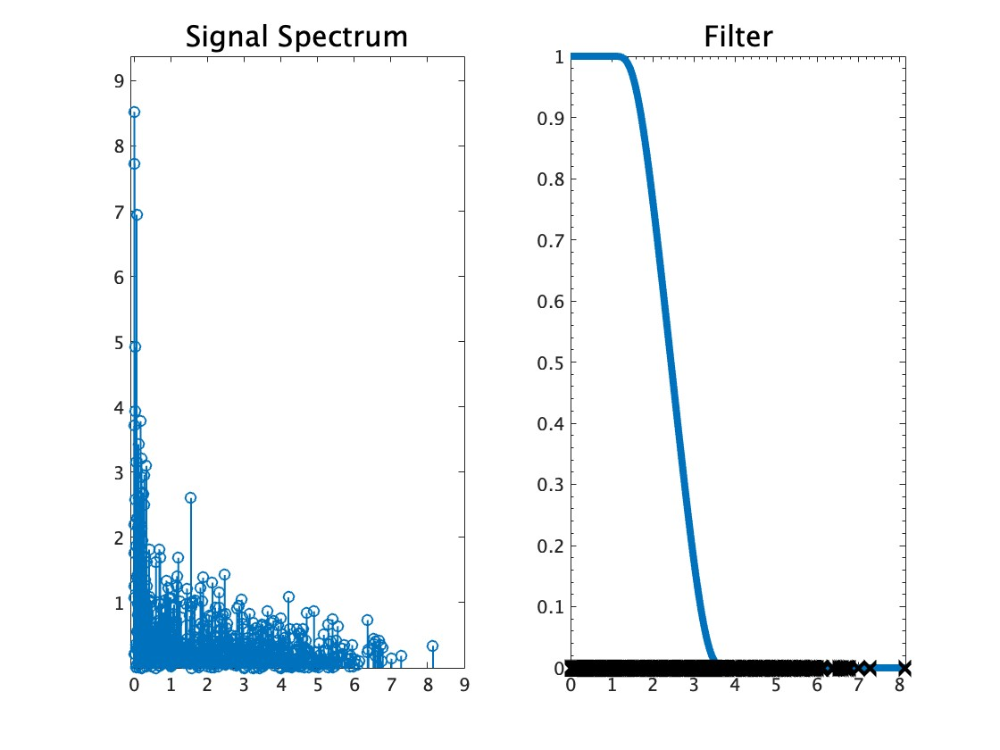
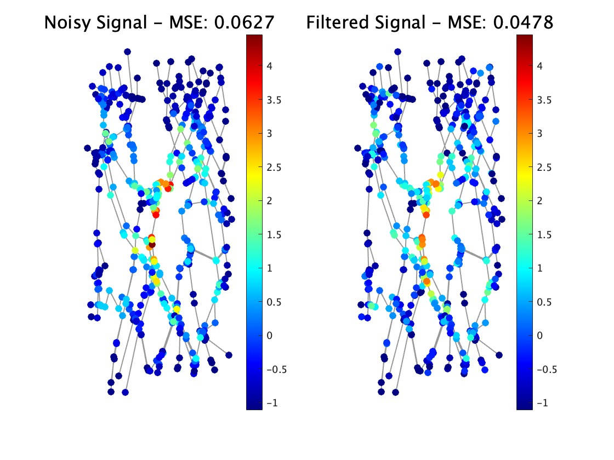

# GSP-Traffic Dataset

Authors : 
    Rui Kumagai ([r.kumagai@msp-lab.org](<mailto:r.kumagai@msp-lab.org>)), 
    Hayate Kojima ([h-kojima@msp-lab.org](<mailto:h-kojima@msp-lab.org>)), 
    Hiroshi Higashi ([higashi@comm.eng.osaka-u.ac.jp](<mailto:higashi@comm.eng.osaka-u.ac.jp>)), 
    and Yuichi Tanaka ([ytanaka@comm.eng.osaka-u.ac.jp](<mailto:ytanaka@comm.eng.osaka-u.ac.jp>))

## Abstract

Data analysis on graphs, including graph signal processing and graph neural networks, is an emerging research field in signal processing and machine learning. 
To quantitatively compare the performance of these methods, reliable datasets containing graphs as well as graph signals are required. 

Then, we propose GSP-Traffic Dataset, a large-scale time-varying graph signal dataset on simulated traffic networks. 
Our dataset utilizes a traffic flow simulator ["Simulation of Urban MObility" (SUMO)](https://eclipse.dev/sumo/).
SUMO can simulate traffic flows under consistent conditions across multiple cities, facilitating easy comparison of graph properties and features. 
It can also utilize actual road networks: This makes the dataset reliable.

GSP-Traffic Dataset is created based on virtual measurements of traffic volume across 465 cities around the world. 
In the dataset, a graph represents a road network where intersections are vertices and roads are edges. 
All the networks are taken from [Open Street Map](https://www.openstreetmap.org/#map=6/35.588/134.380), i.e., real road networks. 
Signals in the dataset are the total number of vehicles passing through intersections obtained by extensive SUMO simulations.
The measurement period is set to 500 seconds. 
To obtain time-varying signals, the entire simulation period is set to 50,000 seconds.
This dataset is beneficial for quantitative analysis of signal processing accuracy without estimation of graphs, and graph learning qualities can be compared within the dataset.


## Overview

In this section, we show the characteristics of the graphs and signals of our dataset.

The table below shows the statistics of the number of vertices and edges.
|   | max | min | mean | median | std | meandegree |
|--:|---:|----:|------:|--------:|---:|-----------:|
| #vertex | 1399 | 102 | 350.54 | 306 | 222.03 | -|
| #edge | 1979 | 125 | 479.88 | 426 | 303.87 | 2.74|

The image below shows the mean signal values and standard deviation in each city of the GSP-Traffic Dataset.



The image below shows the mean and standard deviation of log-energy distribution in the graph frequency domain.



## Installation
This document is written for MATLAB users.
Python users are recommended to refer `README_python.md`.

To install, simply unpack the package from here :  https://github.com/rukumagai/GSP-Traffic-Dataset/releases/tag/v1.0

This is the additional dataset package for GSPtoolbox.
The dataset is recommended to be contained in the 'gspbox' directory.
To use the dataset, start Matlab, run the
```
Traffic_install
```
command. 
This will set up the necessary paths.


## Attribute
For each of the 465 cities, the following data is stored in  `(country)_(city).npz`.

The folder named `dataset` contains all the cities, while the folders named `train` and `test` contain cities selected randomly in a 7:3 ratio.

| variable | attribute | shape |
| -------: | -------: | ----: |
| ` N ` | number of nodes | $` 1 `$ |
| ` T ` | number of time-series | $` 1 `$ |
| ` L ` | Graph Laplacian | $` N \times N `$ |
| ` W ` | Weighted matrix | $` N \times N `$ |
| ` data ` | TV graph signals | $` N \times T `$ |
| ` pos ` | `(longitude,latitude)` of the nodes | $` N \times 2 `$ | 

## Demo for GSP_Traffic Dataset

### Loading Data
You can load data by specifying the city and country as follows:
```
path_name = "GSP_Traffic/GSP_TRAFFIC_MATLAB";

country_name = "Italy";
city_name = "Rome";

files_train = dir(fullfile(path_name, 'train', '*.mat'));
files_test = dir(fullfile(path_name, 'test', '*.mat'));

files = [files_train; files_test]
for i = 1:numel(files)
    if files(i).name==(country_name+'_'+city_name+'.mat')
        filename = fullfile(files(i).folder, files(i).name);
        load(filename);
    end
end
```
You also can describe this part using `path_search(city_name)`, utility function prepared for GSP_Traffic dataset.
```
country_name = "Italy";
city_name = "Rome";

load(path_search(city_name));
```


### Visualizatoin
You can draw the graph and signals.
Since the signals are time-varying, you have to define the time(
default : `t=1`).
```
% Graph construction
G = gsp_graph(double(W),pos);

% Plotting signal + graph
figure;
gsp_plot_signal(G,data(:,1));title(country_name +' - '+ city_name,FontSize=16);
```

#### Output


### Signal Filtering
In the following part, we show a simple denoizing experiment.
Firstly, normalize and put a noise as follows:
```
G = gsp_compute_fourier_basis(G);

% Noize vector
noize = mvnrnd(zeros(N,1),0.75^2*eye(N));

% Normalize data
signal = double(data(:,1));
signal = (signal-mean(signal))./std(signal);
noizy_signal = signal + noize';

% Plot signal
figure;
subplot(121);gsp_plot_signal(G,signal);title("Normalized Signal",FontSize=16);lim=clim;
subplot(122);gsp_plot_signal(G,noizy_signal);title("Noisy Signal",FontSize=16);clim(lim);
```

#### Output


### Design filter
Then, design a low-pass filter as follows:
```
g = gsp_design_smooth_indicator(G,0.1,0.5);
x = gsp_filter(G,g,noizy_signal);
f = gsp_gft(G,signal);
% Plot filter and signal spectrum
figure;
subplot(121);gsp_plot_signal_spectral(G,f);title("Signal Spectrum",FontSize=16);
subplot(122);gsp_plot_filter(G,g);title("Filter",FontSize=16);
```
#### Output


### Plot results
The result of the experiment is shown as follows:
```
default_mse = sqrt(sum((signal-noizy_signal).^2))/279;
filtered_mse = sqrt(sum((signal-x).^2))/279;

figure;
subplot(121);gsp_plot_signal(G,signal);title("Noisy Signal - MSE: "+num2str(default_mse,'%.4f'),FontSize=16);clim(lim);
subplot(122);gsp_plot_signal(G,x);title("Filtered Signal - MSE: "+num2str(filtered_mse,'%.4f'),FontSize=16);clim(lim);
```

#### Output



## Utility functions
### path_search(city_name)
```
path_search(city_name)
```
#### Input parameters:
* `city_name` : the city name, string
#### Output parameters:
* `path` : the path of the city
    
    Search the path of the city you input. 
    You can directly input as the parameter of the function `load()`.
#### Example:
```
city_name = "Rome";
load(path_search(city_name));
G = gsp_graph(double(W),pos)
```
#### Output
```
             W: [544×544 double]
        coords: [544×2 double]
          type: 'from weight'
             A: [544×544 logical]
             N: 544
      directed: 0
    hypergraph: 0
      lap_type: 'combinatorial'
             L: [544×544 double]
             d: [544×1 double]
            Ne: 683
      plotting: [1×1 struct]
```

##
### city_names(country_name)
```
city_names(country_name)
```
#### Input parameters:
* `country_name` : the country name, string
#### Output parameters:
* `cities` : the string array of the names of the city in the country
    
    Search the cities of the country you input. 

#### Example:
```
cities = city_names("Italy")
```
#### Output:
```
cities = 
    "Milano"
    "Rome"
```