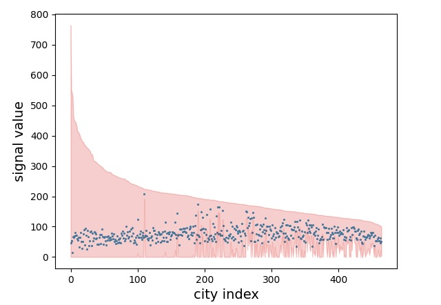

# GSP-Traffic Dataset

Authors : 
    Rui Kumagai ([r.kumagai@msp-lab.org](<mailto:r.kumagai@msp-lab.org>)), 
    Hayate Kojima ([h-kojima@msp-lab.org](<mailto:h-kojima@msp-lab.org>)), 
    Hiroshi Higashi ([higashi@comm.eng.osaka-u.ac.jp](<mailto:higashi@comm.eng.osaka-u.ac.jp>)), 
    and Yuichi Tanaka ([ytanaka@comm.eng.osaka-u.ac.jp](<mailto:ytanaka@comm.eng.osaka-u.ac.jp>))

## Abstract

Data analysis on graphs, including graph signal processing and graph neural networks, is an emerging research field in signal processing and machine learning. 
To quantitatively compare the performance of these methods, reliable datasets containing graphs as well as graph signals are required. 

Then, we propose GSP-Traffic Dataset, a large-scale time-varying graph signal dataset on simulated traffic networks. 
Our dataset utilizes a traffic flow simulator ["Simulation of Urban MObility" (SUMO)](https://eclipse.dev/sumo/).
SUMO can simulate traffic flows under consistent conditions across multiple cities, facilitating easy comparison of graph properties and features. 
It can also utilize actual road networks: This makes the dataset reliable.

GSP-Traffic Dataset is created based on virtual measurements of traffic volume across 465 cities around the world. 
In the dataset, a graph represents a road network where intersections are vertices and roads are edges. 
All the networks are taken from [Open Street Map](https://www.openstreetmap.org/#map=6/35.588/134.380), i.e., real road networks. 
Signals in the dataset are the total number of vehicles passing through intersections obtained by extensive SUMO simulations.
The measurement period is set to 500 seconds. 
To obtain time-varying signals, the entire simulation period is set to 50,000 seconds.

## Overview

In this section, we show the characteristics of the graphs and signals of our dataset. (The list of all cities in the dataset is available in [google spreadsheet](https://docs.google.com/spreadsheets/d/1wJ3MPm5TSh5eKkXRGtqZykiy-HV7anCL_F4yfKACNqo/edit?usp=sharing))

The table below shows the statistics of the number of vertices and edges.
|   | max | min | mean | median | std | meandegree |
|--:|---:|----:|------:|--------:|---:|-----------:|
| #vertex | 1399 | 102 | 350.54 | 306 | 222.03 | -|
| #edge | 1979 | 125 | 479.88 | 426 | 303.87 | 2.74|

The image below shows the mean signal values and standard deviation in each city of the GSP-Traffic Dataset.



The image below shows the mean and standard deviation of log-energy distribution in the graph frequency domain.


## Installation

Access is possible to clone the git repository at
```
git clone https://github.com/kumagai-r-ou/GSP-Traffic-Dataset
```


## Attribute
For each of the 465 cities, the following data is stored in  `(country)_(city).npz`.

The folder named `dataset` contains all the cities, while the folders named `train` and `test` contain cities selected randomly in a 7:3 ratio.

| variable | attribute | shape |
| -------: | -------: | ----: |
| ` N ` | number of nodes | $` 1 `$ |
| ` T ` | number of time-series | $` 1 `$ |
| ` L ` | Graph Laplacian | $` N \times N `$ |
| ` W ` | Weighted matrix | $` N \times N `$ |
| ` data ` | TV graph signals | $` N \times T `$ |
| ` pos ` | `(longitude,latitude)` of the nodes | $` N \times 2 `$ | 


## Citation
If you use this dataset for your research, you may use this bibtex citation:

```
@conference{gsp_traffic,
    title = {GSP-Traffic Dataset: Graph signal processing dataset based on traffic simulation},
    author = {Kumagai, Rui and Kojima, Hayate and Higashi, Hiroshi and Tanaka, Yuichi},
    booktitle = {Graph Signal Processing Workshop 2024, Delft, The Netherlands},
    year = {2024},
    month = {Jun},
}
```

## Examples

### Python (with [pygsp](https://pygsp.readthedocs.io/en/stable/))
```
import os
import numpy as np
from pygsp import graphs
from util import draw_graph

files = [filename for filename in os.listdir('GSP_Traffic/GSP_TRAFFIC_Python') ]

npz = np.load(os.path.join('GSP_Traffic/GSP_TRAFFIC_Python',files[0]))    # decide the file index
N,T,W,L,data,pos = npz['N'], npz['T'], npz['W'], npz['L'], npz['data'], npz['pos']
G = graphs.Graph(W)

t = 0    # decide the signal time
draw_graph(G,data[:,t],pos)
```


## Utility functions
### plotting
```
draw_graph(G, pos, data=None, image=None)
```
Draw the graph G with matplotlib.

You don't have to give `data` when you draw the graph G as a simple representation.
If you want to draw the graph G reflecting signal values, you can give `data`.

#### parameters:

* `G` : graph

	A pygsp graph.

* `pos` : numpy array ($`N \times 2`$)

	A numpy array representing position of the nodes.

* `data` : numpy array ($`N \times 1`$), optional

	A numpy array representing signal values at time $`t`$.

* `image` : string, optional

    filename to save the image. 


#### Example
```
import os
import numpy as np
from pygsp import graphs
from util import draw_graph

npz = np.load(os.path.join('dataset','Italy_Rome.npz'))
N,T,W,L,data,pos = npz['N'],npz['T'],npz['W'],npz['L'],npz['data'],npz['pos']
G = graphs.Graph(W)

draw_graph(G,pos,image='Italy_Rome.png')
```
#### Output


#### Example
```
import os
import numpy as np
from pygsp import graphs
from util import draw_graph

npz = np.load(os.path.join('dataset','Italy_Rome.npz'))
N,T,W,L,data,pos = npz['N'],npz['T'],npz['W'],npz['L'],npz['data'],npz['pos']
G = graphs.Graph(W)

draw_graph(G,pos,data[:,0],image='Italy_Rome_signal.png')
```

#### Output
