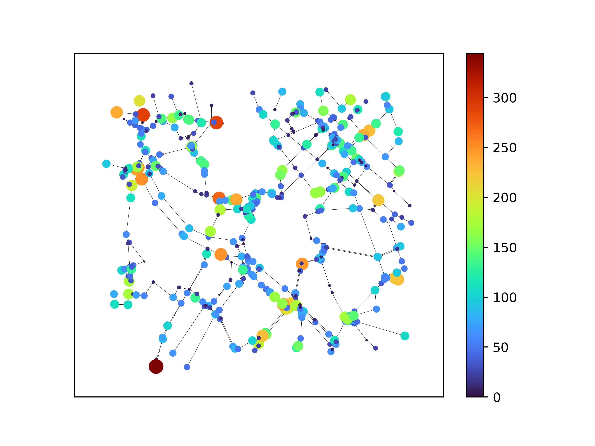

# GSP-Traffic Dataset

作成者：
	[熊谷塁](<mailto:r.kumagai@msp-lab.org>)，
	[小島颯](<mailto:h-kojima@msp-lab.org>)，
	[東広志](<mailto:higashi@comm.eng.osaka-u.ac.jp>)，
	[田中雄一](<mailto:ytanaka@comm.eng.osaka-u.ac.jp>)

## Overview
信号処理や機械学習では，画像や音声のような単純な構造を持つデータが研究の対象とされてきた.
しかし，画像や音声だけでなく，交通ネットワークや社会的ネットワークをはじめとする複雑な構造を持つデータの解析需要が高まってきている.
このようなデータは空間的に複雑かつ不均一に分布しているため従来の解析技術を直接適用できない.
そのためグラフ上 の信号処理や機械学習といったデータ解析技術が注目を集めている.
グラフ上データ解析手法の性能を定量的に比較するためにはベンチマークデータセットの存在が必要不可欠である.
しかし，グラフ信号のデータセットは少なく，さらに時変グラフ信号を扱う多くの論文では，そのグラフがk近傍法などにより推測されたものであったり，信号値を人工的に生成していたりすることが多い.

GSP-Traffic Datasetは，このような問題を解決する，交通ネットワーク上でのシミュレーションにより作成された時変グラフ信号データセットである．
シミュレーションには，交通流シミュレータ ["Simulation of Urban MObility" (SUMO)](https://sumo.dlr.de/docs/index.html) を使用した．
SUMOを用いることで，複数の国や都市に対して同一条件でシミュレーションを行うことができるため，グラフの性質や特徴の比較がしやすいという利点がある.
本研究で作成したデータセットは，465ヶ所の人口100万人以上の都市についての交通量を仮想的に計測したものである.
グラフは，交差点を頂点，道路を辺とするものであり，[Open Street Map](https://www.openstreetmap.org/#map=6/35.588/134.380)から地図データを取得し，作成された．
また，信号値は500秒間に交差点を通過した車両の合計台数とした.
時系列データを生成するために，50,000秒間のシミュレーションを行った.
このデータセットにより，グラフ信号および時変グラフ信号を扱うグラフ上データ解析手法の統一的な評価が可能となる.


<!--  -->


## Installation
以下のコマンドを実行することでデータセットにアクセスできます．
```
git clone https://github.com/kumagai-r-ou/GSP-Traffic-Dataset
```

## Attributes

465都市それぞれに対して ``` (country)_(city).npz ``` の形で，以下のデータが格納されています．

| Variable | Attributes | Shape |
| -------: | :-------: | ----: |
| ` N ` | 頂点数 | $` 1 `$ |
| ` T ` | 信号の時間 | $` 1 `$ |
| ` L ` | グラフラプラシアン | $` N \times N `$ |
| ` W ` | 重み付き隣接行列（重みは全て1） | $` N \times N `$ |
| ` data ` | 時変グラフ信号 | $` N \times T `$ |
| ` pos ` | 頂点の座標 (軽度，緯度) | $` N \times 2 `$ | 

## Examples

### python(with [pygsp](https://pygsp.readthedocs.io/en/stable/))
```
import os
import numpy as np
from pygsp import graphs


files = [filename for filename in os.listdir('dataset') ]
npz = np.load(os.path.join('dataset',files[i]))
npz = np.load(filename)
N,T,W,L,data,pos = npz['N'], npz['T'], npz['W'], npz['L'], npz['data'], npz['pos']
G = graphs.Graph(W)
draw_graph(G,data[:,0],pos)
```

### matlab


## Utility functions

いくつかの関数が用意されています．
```
from util import draw_graph
```

### plotting

Draw the graph G with matplotlib.

You don't have to give `data` when you draw the graph G as a simple representation.
If you want to draw the graph G reflecting signal values, you can give `data` 
```
draw_graph(G, pos, data=None)
```

parameters:

`G`:graph

A pygsp graph

`pos`:numpy array ($`N \times 2`$)

A numpy array representing position of the nodes.

`data`:numpy array ($`N \times 1`$), optional


<!-- 
| How to call | Argument | Explanation |
| ----------- | -------- | ----------- |
| draw_graph(G, pos, data) | G : graph <br> pos : $ N \times 2 $ <br> data : TV signals <br> output_name = 'out' | plotting function. <br> Output name is 'undir.png' | -->